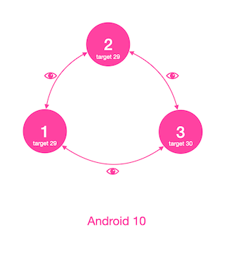

# Experiment of Package Visibility on Android 11

## Purpose of this Experiment

>Android 11 changes how apps can query and interact with other apps that the user has installed on a device. 

I built several apps, and they share data between each other by using Content Provider in each app.

Recently, one of my apps moved to `targetSdkVersion 30`, and I found that `package visibility`
change in `Android 11` makes apps are invisible to each other in some situation.

This experiment is to find out the `simplest solution` making my apps `visible to each other`, regardless the installation
order, apps development targetSdkVersion, running Android OS version, or app signatures.


## The problem

`Given:`
- app1 - targetSdkVersion 29
- app2 - targetSdkVersion 29
- app3 - targetSdkVersion 30
- running on device with Android 11 emulator

`Problem:`

Regardless the installation order, app1 and app2 are `invisible to app3`, until app1/app2 access Content Provider in app3.


## Solution

Simplest solution is making sure every app defines which apps they would like to visit. So in `AndroidManifest.xml`, add package name (aka applicationId) under `<queries>`:
```
<queries>
    <package android:name="com.mocoven.app1" />
    <package android:name="com.mocoven.app2" />
    <package android:name="com.mocoven.app3" />
</queries>
```


## By the way

Tested in Android 10 emulator, no behaviour change in below setup regardless the installation order:

`Given:`
- app1 - targetSdkVersion 29
- app2 - targetSdkVersion 29
- app3 - targetSdkVersion 30
- running on device with Android 10 emulator

`Result:` apps are visible to each other




## Apps visible automatically

Android [automatically](https://developer.android.com/training/basics/intents/package-visibility#automatic) makes some apps visible to your app so that your app can interact with them without needing to declare the `<queries>` element. For example, any app that accesses a Content Provider in your app. 

This explains app1 is invisible to app3 until app1 access the Content Provider in app3. If we don't want to rely on user open and use app1, I would suggestion declare queries.

Last note, 
> If your app targets Android 10 (API level 29) or lower, all apps are visible to your app automatically.

## Reference
https://developer.android.com/about/versions/11/privacy/package-visibility

